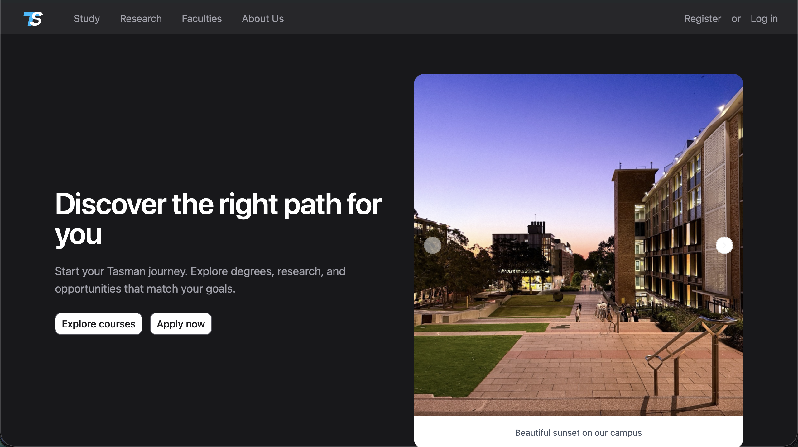

## Tasman Frontend

Tasman Frontend is the **minimal, modern UI** for the Tasman backend API.  
The focus of this repo is to provide a **sleek, dark zinc-themed interface** for exploring courses, departments, and internal admin views, while keeping the implementation straightforward so most of the complexity can live in the backend.

The app is built with **React**, **Tailwind CSS**, and **shadcn/ui**, using a small set of well-structured pages, layouts, and shared components (like navigation and cards) to keep the codebase easy to understand and extend later.

---

### Live Demo



> TODO: update link after deploying to Vercel.

[Link to Tasman Frontend](placeholder.com)


---

### Table of Contents

1. [Live Demo](#live-demo)
2. [Screenshot](#screenshot)
3. [Tech Stack](#tech-stack)
4. [Getting Started](#getting-started)
5. [Available Scripts](#available-scripts)
6. [Project Structure](#project-structure)
7. [Key UI Concepts](#key-ui-concepts)

---

### Tech Stack

- **React** (with TypeScript) for the component-based UI and routing logic.
- **React Router** for client-side routing between public, auth, and internal/admin pages.
- **Tailwind CSS** (zinc-based palette) for utility-first styling and custom theming.
- **shadcn/ui** components (button, card, inputs, carousel, etc.) for consistent, accessible primitives.
- **Vite** for fast dev server and build tooling.

---

### Getting Started

```bash
# install dependencies
npm install

# run dev server
npm run dev

# build for production
npm run build
```

By default the app expects a separate **backend API** (not included here).  
This repo is intentionally UI-only: it focuses on layout, navigation, and visual design rather than data modelling.

---

### Available Scripts

- **`npm run dev`**: start the Vite dev server.
- **`npm run build`**: type-check and build the production bundle.
- **`npm run preview`**: preview the built app.
- **`npm run lint`**: run ESLint over the project.

---

### Project Structure

Only the important pieces are listed to keep things simple:

```text
src/
  App.tsx                # Top-level router definition
  main.tsx               # React entry point
  index.css              # Tailwind & shadcn theme configuration

  layout/
    PublicLayout.tsx     # Public shell (navbar + outlet)
    InternalLayout.tsx   # Internal shell for logged-in/admin views

  components/
    PublicNavBar.tsx     # Public navigation bar (logo + links + auth entry)
    InternalNavBar.tsx   # Internal navigation/navigation for admin area
    PublicImageSlider.tsx# Hero carousel on the welcome page
    NavItem.tsx          # Reusable nav link with active state
    TasmanLogo.tsx       # SVG logo used in nav and branding

    ui/                  # shadcn/ui-based primitives
      button.tsx
      card.tsx
      carousel.tsx
      input.tsx
      textarea.tsx
      checkbox.tsx
      select.tsx
      label.tsx
      field.tsx
      separator.tsx

  pages/
    public/
      Welcome.tsx        # UNSW-inspired landing page (Tasman theme)
      Department.tsx     # Public-facing view of departments
      course/
        Courses.tsx      # Public course list
        Course.tsx       # Individual course details

    auth/
      LogIn.tsx          # Login UI (hooked to backend auth)
      Register.tsx       # Registration UI

    admin/
      Admin.tsx          # Admin dashboard entry
      Student.tsx        # Admin student management
      Instructor.tsx     # Admin instructor management
      Major.tsx          # Admin major management

    internal/
      User.tsx           # Internal user/home page after login

  lib/
    utils.ts             # Small shared helpers (e.g. className merge)
```

---

### Key UI Concepts

- **Minimal but polished**: dark zinc palette with subtle motion (hover scales, auras, and carousels) to keep the UI feeling modern without over-engineering.
- **Clear separation of concerns**: layouts (`PublicLayout`, `InternalLayout`) wrap feature pages, while shared UI primitives live in `components/ui`.
- **Backend-first mindset**: the frontend intentionally avoids complex state management and heavy client logic, so most of the work can stay in the backend API while the UI remains easy to reason about and iterate on.

This should be enough context to onboard quickly, tweak styling, or extend new pages while keeping the surface area of the frontend small.